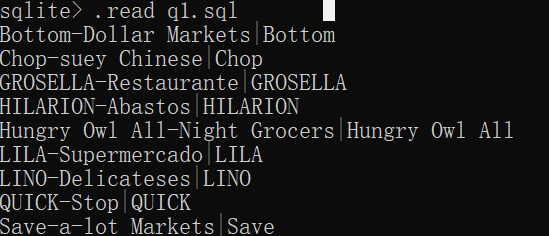
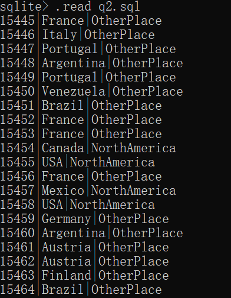
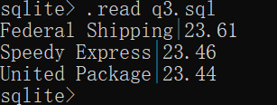
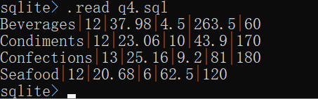
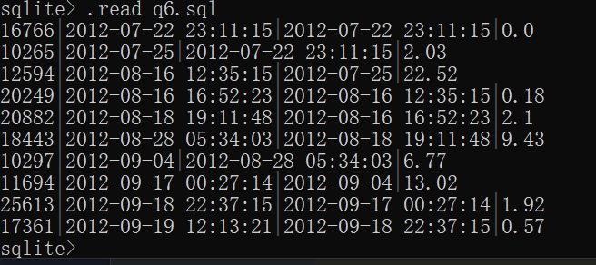
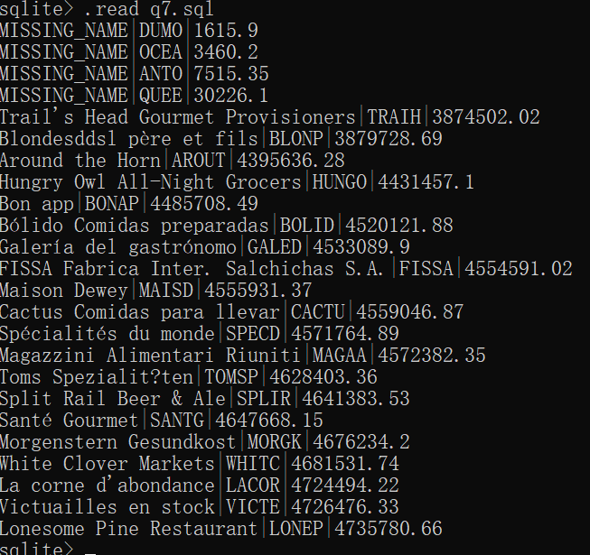
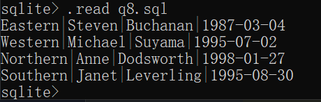

# sql_homework
# Q1
```sql
select distinct shipname, substr(shipname,1,instr(shipname, "-")-1)
from 'order'
where shipname like '%-%'
order by shipname asc;
```
  
# Q2
```sql
select id, shipcountry, 
case when shipcountry = 'USA' or shipcountry = 'Mexico' or shipcountry = 'Canada'
	then 'NorthAmerica'
	else 'OtherPlace'
end
from(
	select id, shipcountry
	from 'order'
	order by id asc
)
where id >= 15445
limit 20;
```
  
# Q3
```sql
select companyname, (
	select round((latenum * 1.0) / (num * 1.0) * 100, 2)
	from
		(select count(*) as latenum
		from 'order'
		where shipvia = shipper.id and ShippedDate > RequiredDate)
	    ,
		(select count(*) as num
		from 'order'
		where shipvia = shipper.id)
) as percentage
from shipper
order by percentage desc
```
  
# Q4
```sql
select * from(
	select categoryname, count(*) as num, round(avg(unitprice),2), min(unitprice), max(unitprice), sum(unitsonorder)
	from category, product
	where category.id = product.categoryid
	group by category.id
	order by category.id
)
where num > 10
```
  
# Q5
```sql
select productname, companyname, contactname from(
	select P.productname, min(O.orderdate), customerid
	from product as P, orderdetail as OD, 'order' as O
	where P.discontinued = 1 and P.id = OD.productid and OD.orderid = O.id
	group by P.productname
	order by P.productname 
), customer as C
where customerid = C.id
```
  
# Q6
```sql
select *, round(julianday(orderdate) - julianday(predate), 2)from(
	select O.id, O.orderdate,
	lag(orderdate, 1, orderdate) over(order by orderdate asc) predate
	from(
		select C.id 
		from customer as C
		where c.id = 'BLONP'
	) as C, 'order' as O
	where C.id = O.customerid
	limit 10
)
```
  
# Q7
```sql
select companyname, customerid, exp from(
	select companyname, customerid, exp,
	ntile(4) over (
	    order by exp asc
) as ntile from(
	select companyname, all_c.customerid , round(sum(unitprice * quantity), 2) as exp 
	from(
		select ifnull(companyname, 'MISSING_NAME') as companyname, customerid from(
			select distinct customerid
			from 'order'
		) as O left outer join customer as C on C.id = O.customerid
	) as all_c, 'order' as O, orderdetail as OD 
	where all_c.customerid = O.customerid and O.id = OD.orderid
	group by all_c.customerid
)
)
where ntile = 1
```
  
# Q8
```sql
select regiondescription, firstname, lastname, max(birthdate)
from employee as E, employeeterritory, territory as T, region as R
where R.id = regionid and T.id = territoryid and employeeid = E.id
group by regiondescription
order by R.id
```
  
# Q9
```sql
select group_concat(productname, ', ') from(
	select productname 
	from customer as C, 'order' as O, orderdetail, product as P
	where companyname = 'Queen Cozinha' and C.id = O.customerid
	and O.id = orderid and productid = P.id
	and orderdate like '2014-12-25%'
	order by P.id asc
)
```
  
